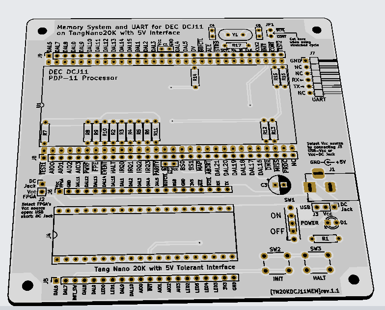

# TangNanoDCJ11MEM
Memory system and UART implemented on Tang Nano 20K for DEC DCJ11 PDP-11 Processor

This document is written mostly in Japanese. If necessary, please use a translation service such as DeepL (I recommend this) or Google.

# 概要
PDP-11の命令セットを持つCPU「DEC DCJ11」のメモリシステムとUARTをFPGA(TangNano20K)上に実装する試みです。信号のインターフェース部分に[tangNano-5V](https://github.com/ryomuk/tangnano-5V)を使用しています。

FPGAに実装するのはメモリやUARTなどの周辺回路部分だけで、CPU自体は本物を使用します。ソフトウェアやFPGAによるシミュレータやエミュレータではなく、本物のCPUを動かします。

"TangNanoDCJ11"だとTangNano上にDCJ11を実装したみたいな名前になってしまうので、"MEM"を付けて"TangNanoDCJ11MEM"という名前になっています。

# ハードウェア
## FPGAに実装した機能
- Initialization Sequence時のPower-Up Configuration Register設定
- メモリ 32K×16bit
- UART．TangNanoのUSB経由およびGPIO経由の2系統
- BS0, BS1は見ていません．TangNano20Kではピンが足りなかったのと，DAL[15:0]とAIO[3:0]を見ればとりあえず十分だったので．
- DAL[21:16]も見ていません．

## ブレッドボード版
- console ODT(Octal Debug Technique)の動作確認をするところから始めて，[豊四季タイニーBASIC](https://github.com/vintagechips/ttbasic_arduino)を軽微な修正で動かせるところまで確認しました．
- クロックは18MHzで動きました．遅い方は2MHzでも動きました．

## PCB版
### rev.1.0
最初に作った基板です．とりあえず動きました．

### rev.1.1
- 現在(2024/4/25)注文中の基板です．動作確認できたら情報を更新します．
- ジャンパの意味などは回路図と基板上のシルクを見て下さい．

#### BOM
|Reference          |Qty| Value          |Size |Memo |
|-------------------|---|----------------|-----|-----|
|C1,C2              |2	|0.33uF	         ||0.1uFでもいいような気がするけどDECのプロセッサボードで0.33uFを使っていたので|
|C3                 |1  |47uF            |||
|C4,C5              |2  |68pF            |||
|D1                 |1  |LED             || |
|J1                 |1  |BarrelJack      ||https://akizukidenshi.com/catalog/g/g106568/ |
|J2                 |1  |pin header      |1x02||
|J3                 |1  |pin header      |1x03||
|J4                 |1  |IC socket      |40pin dip 600mi|TangNano5V用。1x20のpin socket 2列でも可|
|J5,J6              |2  |pin header or socket|1x20|テスト用|
|J7                 |1  |pin header      |1x06 L字|UART用|
|J8,J9              |2  |pin header or socket|1x30|テスト用|
|JP1                |   |                || sctl_nとcont_nを切断したときにpin headerを立てる用|
|R1                 |1  |100K            || 値はLEDに合わせて任意。|
|R2～16             |15 |100K            || プルアップ、プルダウン用。10～100Kで任意。Iiのmaxが10μAなのでとりあえず大きめに設定|
|R17                |1  |1M              |||
|SW1                |1  |toggle SW       ||https://akizukidenshi.com/catalog/g/g100300/ |
|SW2,SW3            |2  |tactile SW      |6mmxH4.3mm|
|U1                 |1  |DCJ11           |60pin DIP 1300mil| 1x30 の丸ピンヘッダー2列|

# PDP-11用プログラム開発環境
- TBA

# 関連情報
## データシート等
### bitsavers
- [DCJ11 Microprocessor User's Guide](http://www.bitsavers.org/pdf/dec/pdp11/1173/EK-DCJ11-UG-PRE_J11ug_Oct83.pdf), DEC, EK-DCJ11-UG-PRE(Preliminary)
- [Index of /pdf/dec/pdp11/j11](http://bitsavers.trailing-edge.com/pdf/dec/pdp11/j11/)
- [Index of /pdf/dec/pdp11/1173](http://bitsavers.trailing-edge.com/pdf/dec/pdp11/1173/)

## 先行事例、先駆者たち
- [PDP-11/HACK](http://madrona.ca/e/pdp11hack/index.html)
- [My PDP-11 Projects](https://www.5volts.ch/pages/pdp11hack/)
- [PDP11 on a breadboard A.K.A. J11 Hack](https://www.chronworks.com/J11/)
- [S100 Bus PDP-11 CPU Board](http://www.s100computers.com/My%20System%20Pages/PDP11%20Board/PDP11%20Board.htm)

# 更新履歴
- 2024/4/25: 初版公開

