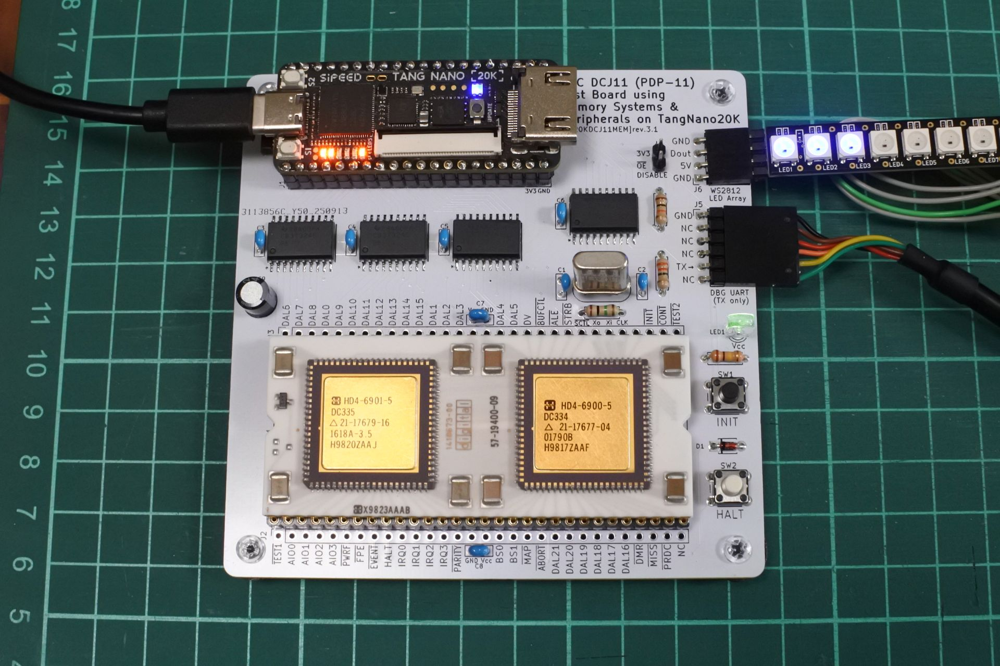
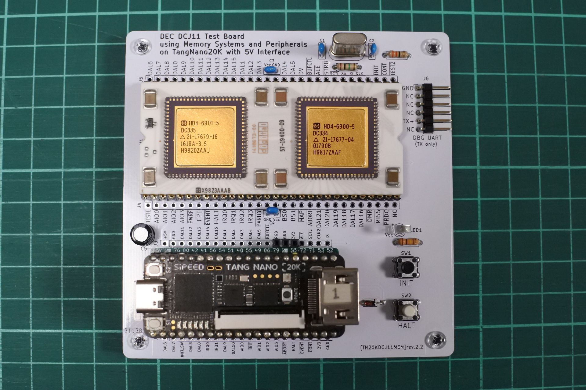
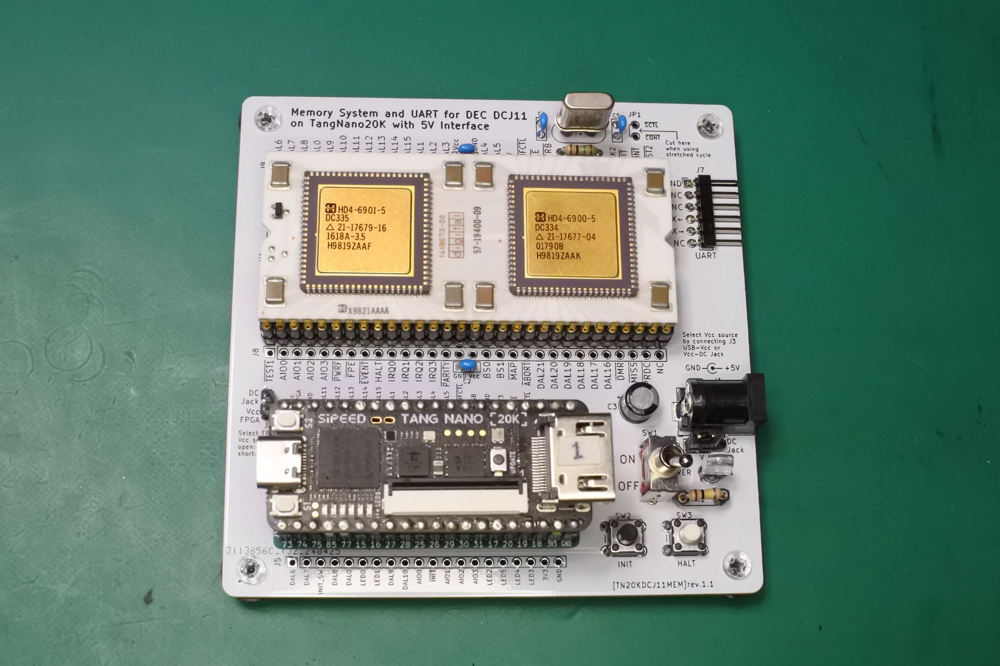
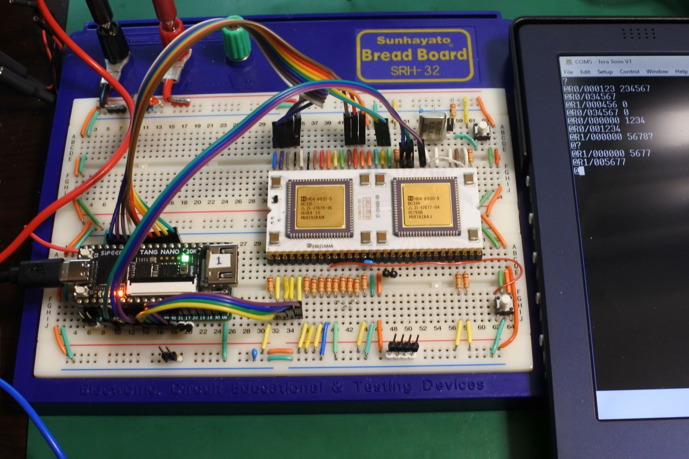
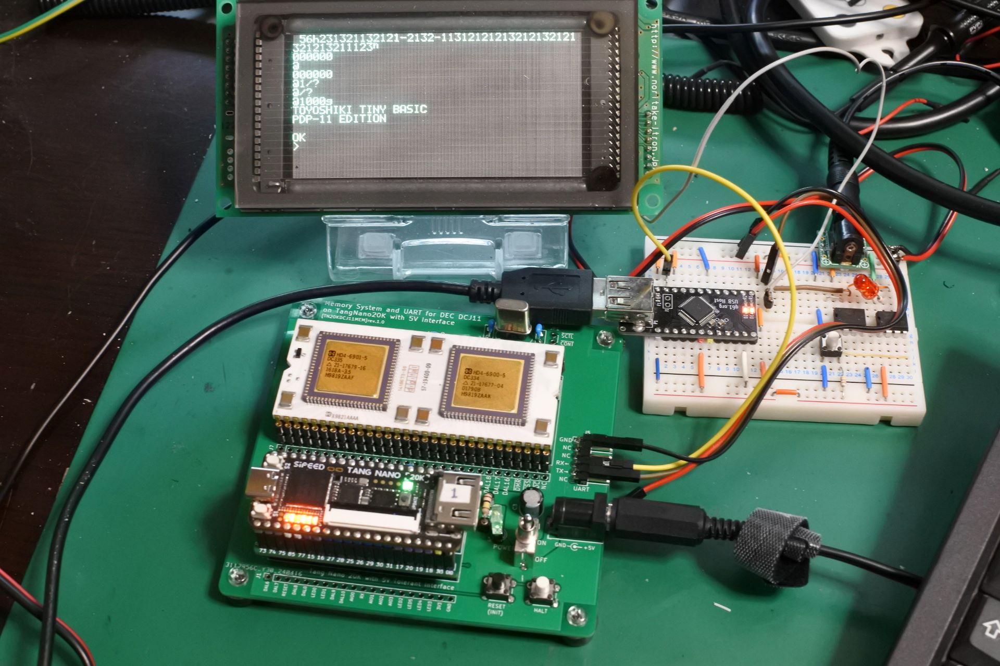

# TangNanoDCJ11MEM
Memory system and UART implemented on Tang Nano 20K for DEC DCJ11 PDP-11 Processor

This document is written mostly in Japanese. If necessary, please use a translation service such as DeepL (I recommend this) or Google.

- 本プロジェクトはTang Console 138Kを用いた続編[TangConsoleDCJ11MEM](https://github.com/ryomuk/TangConsoleDCJ11MEM)があります．
- このREADMEおよび[hdl.old](./hdl.old)フォルダ配下のREADMEに書かれている不安定である旨の記述は2024年に作成したrev1.1基板のものです．rev.2.xになってかなり安定しましたが，記録として残しておきます．

# 概要
- PDP-11の命令セットを持つCPU「DEC DCJ11」のメモリシステムとUARTをFPGA(TangNano20K)上に実装する試みです．信号のインターフェース部分に[tangNano-5V](https://github.com/ryomuk/tangnano-5V)を使用しています．(rev.3.1基板では不要)
- FPGAに実装するのはメモリやUARTなどの周辺回路部分だけで，CPU自体は本物を使用します．ソフトウェアやFPGAによるシミュレータやエミュレータではなく，本物のCPUを動かします．
- "TangNanoDCJ11"だとTangNano上にDCJ11を実装したみたいな名前になってしまうので，"MEM"を付けて"TangNanoDCJ11MEM"という名前になっています．
- まずベアメタルで動かしたところ安定して動きました．
- 次に，PC-11(Paper-Tape Reader/Punch)エミュレータでPaper-Tape BASICをロードして実行することができました．
- さらに，UNIX first edition (UNIX V1)を動かすために，ディスク(RF11, RK11)や外部演算装置(KE11)のエミュレータを実装したところ，それなりに動くようになりました．

# 最近の話題
- 2025/09/03: 本プロジェクトの続編[TangConsoleDCJ11MEM](https://github.com/ryomuk/TangConsoleDCJ11MEM)を公開
- 2025/09/05: rev2.2基板公開
- 2025/09/22: レベル変換ICを搭載した基板rev3.1を公開
- 最新版は下記の通り
  - レベル変換外付け版([rev2.2](pcb/rev2.2))．(別途[TangNano5V](https://github.com/ryomuk/tangnano-5V)が必要です．)
  - レベル変換搭載版([rev3.1](pcb/rev3.1))
  - 上記のどちらもHDLコードは共通です．
    - [UNIX用のHDLコード](./hdl/unix)(unix-v1, unix-v6 共通)
    - [tapebasic用のHDLコード](./hdl/tapebasic)

# 主なファイル一覧
```
.
├── diskimage : SDメモリ用データ
│   ├── Caldera-license.pdf : UNIXのライセンス条項
│   ├── sd-unix-v1.dsk      : unix v1用disk image
│   └── sd-unix-v6.dsk      : unix v6用disk image
├── hdl              : rev2.x, rev3.x基板用HDLコード
│   ├── tapebasic
│   └── unix
├── hdl.old          : rev1.1基板用HDLコード
│   ├── baremetal
│   ├── tapebasic
│   ├── unix-v1
│   └── unix-v6
├── pcb
│   ├── rev1.1      : rev1.1基板
│   ├── rev2.2      : rev2.2基板
│   └── rev3.1      : rev3.1基板
└── README.md        : このファイル
```
- diskimageフォルダ内にあるSDメモリ用のイメージファイルはUNIXのオリジナルソースからの派生物なので，ライセンス条件は Caldera-license.pdf (昔のBSD?)に従います．
- その他の部分についてはMITライセンスです．

# 基板のバージョンについて
- [TangConsole138Kを用いたプロジェクト](https://github.com/ryomuk/TangConsoleDCJ11MEM)を開始した際に，CLK2に同期させるとかなり安定するという知見が得られたので，アップデートするついでに各種パッチを反映させた基板(rev2.2)を作成しました．
- ついでに，レベル変換を搭載した基板(rev3.1)も作成しました．
- それぞれの基板は下記のような関係にあります．
```
rev1.1
↓ unix v1, v6用パターンカット，ジャンパ, HALTのダイオード追加, CLK2同期化
rev2.2
↓ レベル変換(TangNano5V相当)を基板上に搭載(CPUの入力信号(FPGA→CPU)については省略)
rev3.1
```
- rev1.1基板に「unix-v1, v6用のパターンカット，ジャンパ線」，「CLK2とGPIO_RXを33Ωで接続」，「HALTのダイオード」を追加することでrev2.2基板と同じ回路になり，rev2.x基板用のHDLコードで動作します．
- rev3.1基板はrev2.2基板にレベル変換を搭載しただけなので同じHDLコードが動きます．
- rev1.1基板用のHDLコードはrev2.x, rev3.x基板では動きません．

# ハードウェア
## FPGAに実装した機能
- Initialization Sequence時のPower-Up Configuration Register設定
- メモリ 32K×16bit
- UART．TangNanoのUSB経由およびGPIO経由の2系統．シリアルの設定は基本的には115200bps,8N1Nにしています．(UNIX V6だと7N1Nにしないと文字化けする現象あり．)
- BS0, BS1は見ていません．TangNano20Kではピンが足りなかったのと，DAL[15:0]とAIO[3:0]を見ればとりあえず十分だったので．
- DAL[21:16]も見ていません．
- PC-11(Paper-Tape Reader/Punch)エミュレータを実装しました．(Paper tape BASICを実行する用で，UNIXでは動きません．)
- ディスクドライブ(RF11, RK11)，外部演算装置(KE11-A)，クロック(KW11-L)等，UNIX V1の動作に必要な装置のエミュレータを実装しました．

## rev3.1基板 (PCB rev3.1)
- レベル変換ICを基板上に実装しました．これによりTang Nano 20KをTangNano5Vを使わずに直接搭載できます．
- ピンアサインはrev2.x基板と同じなので，FPGA用のコードはrev2.x用のものを使用します．
- WS2812のアレイを接続するための端子を用意しました．

#### BOM (PCB rev3.1)
|Reference          |Qty| Value          |Size |Memo |
|-------------------|---|----------------|-----|-----|
|C1,C2|2|68pF|||
|C3,C4, C5, C6|4|0.1uF|||
|C7,C8|2|0.33uF|||
|C9    |1|47uF|||
|D1    |1|1N4148|||
|J1    |1|IC socket |40pin DIP 800mil|TangNano20K用．幅800milなので1x20のpin socketを2列実装．|
|J2,J3|2  |pin header or socket|1x30|任意．テストや観測，実験用．|
|J4                 |1  |pin header      |1x02|任意．OE_nをdisableにする用|
|J5                 |1  |pin socket      |1x04 L字|WS2812アレイ用|
|J6                 |1  |pin header      |1x06 L字|UART用|
|LED1    |1||||
|R1 |1|1M|||
|R2 |1|33|||
|R3,R4,R5,R6,R7,R8,R9,R10,R11,R12,R13,R14,R15|13|10k|
|R16|1|100k  || 値はLEDに合わせて任意．|
|SW1,SW2  |2  |tactile SW      |6mmxH4.3mm|例: https://akizukidenshi.com/catalog/g/g103647/ |
|U1                 |1  |DCJ11           |60pin DIP 1300mil| 1x30 の丸ピンソケット2列|
|U2,U3,U4,U5  |4  |SN74CB3T3245DWR(又は DW) | SOIC-20| パッケージサイズに注意|

|Y1                 |1  |18MHz           |HC49|例: https://mou.sr/3WcWExh , 周波数を変えられるようにソケットの使用をお勧めします．|

- SN74CB3T3245はパッケージサイズに注意．SOIC-20はDWかDWRです．PWやPWRではありません．
- R2は"33k"ではなく"33"です．ダンピング抵抗なので．
- R12，最近のLEDは明るいので100kぐらいでちょうど良かったりします．使うLEDに応じて適切な値を選んで下さい．

## rev2.2基板 (PCB rev2.2)
- rev1.1基板でunixを動かすために必要だったパターンカットとジャンパ配線を反映させました．
- CLK2をGPIO_RXだったピンに入力して，回路をCPUのクロックと同期させました．
- 上記に伴い，基板のUART端子はデバッグログ用のTXだけになりました．
- 電源供給をTangNanoからだけにしてDCジャックを廃止しました．
- HALTスイッチのところの抵抗をダイオードに変更しました．
- unix(v1, v6)を動作させるためのプロジェクトは[hdl/unix](hdl/unix/)を使用して下さい．
- SDメモリ用のイメージファイルは[./diskimage](./diskimage)にあるものがそのまま使えます．


#### BOM (PCB rev2.2)
|Reference          |Qty| Value          |Size |Memo |
|-------------------|---|----------------|-----|-----|
|C1, C2|2|68pF|||
|C3, C4|2|0.33uF|||
|C5    |1|47uF|||
|D1    |1|1N4148|||
|J1    |1|IC socket |40pin DIP 600mil|TangNano5V用．1x20のpin socket 2列でも可．|
|J2,J3 |2|pin header or socket|1x20|任意．テストや観測，実験用．|
|J4,J5 |2  |pin header or socket|1x30|任意．テストや観測，実験用．|
|J6                 |1  |pin header      |1x06 L字|UART用|
|LED1    |1||||
|R1 |1|1M|||
|R2 |1|33|||
|R3,R4,R5,R6,R7,R8,R9,R10,R11,R12,R13,R14|12|10k|
|R15|1|100k  || 値はLEDに合わせて任意．|
|SW1,SW2  |2  |tactile SW      |6mmxH4.3mm|例: https://akizukidenshi.com/catalog/g/g103647/ |
|U1                 |1  |DCJ11           |60pin DIP 1300mil| 1x30 の丸ピンソケット2列|
|Y1                 |1  |18MHz           |HC49|例: https://mou.sr/3WcWExh , 周波数を変えられるようにソケットの使用をお勧めします．|

## rev1.1基板 (PCB rev1.1)
- rev1.0はいくつか修正箇所があったので修正しました．
- CPUが白いので基板も白くしてみました．
- CPUおよびTangNanoの電源をどこから供給するかを2箇所のジャンパで切り替えられるようにしました．詳細は回路図と基板上のシルクを見て下さい．
- プルダウン抵抗(R2〜R6)を100kから10kに変更しました．(rev1.1a)
- UNIXを動かすにはJP1のパターンのカット，数本のジャンパ配線が必要です．詳細は[UNIX V1](hdl.old/unix-v1/)参照．

#### BOM (PCB rev1.1)
|Reference          |Qty| Value          |Size |Memo |
|-------------------|---|----------------|-----|-----|
|C1,C2              |2	|0.33uF	         ||DECのプロセッサボードで0.33uFを使っていたので．0.1uFでもいいかもしれない．|
|C3                 |1  |47uF            |||
|C4,C5              |2  |68pF            |||
|D1                 |1  |LED             || |
|J1                 |1  |DC Jack         ||例: https://akizukidenshi.com/catalog/g/g106568/ |
|J2                 |1  |pin header      |1x02|DC Jackからの5VをTangNanoに供給するとき用．(そのときはTangNanoのUSBは外すこと)．|
|J3                 |1  |pin header      |1x03|CPUへの5VをDC JackからにするかUSB(TangNano)からにするかの選択用．|
|J4                 |1  |IC socket       |40pin DIP 600mil|TangNano5V用．1x20のpin socket 2列でも可．|
|J5,J6              |2  |pin header or socket|1x20|任意．テストや観測，実験用．|
|J7                 |1  |pin header      |1x06 L字|UART用|
|J8,J9              |2  |pin header or socket|1x30|任意．テストや観測，実験用．|
|JP1                |   |                ||任意．sctl_nとcont_nを切断したときにpin headerを立てる用．実装する場合は先にパターンをカットして下さい．(unix-v1では切断して使います)|
|R1                 |1  |100k            || 値はLEDに合わせて任意．|
|R2～R6             |5 |10k            || プルダウン用．入力電流がmax10μAなので大きめでいいかと思ったら意外にノイズが大きいので100kから10kに変更しました．|
|R7～R16             |10 |100k            || プルアップ用．10k〜100kぐらいで任意．|
|R17                |1  |1M              |||
|SW1                |1  |toggle SW       ||例: https://akizukidenshi.com/catalog/g/g100300/ |
|SW2,SW3            |2  |tactile SW      |6mmxH4.3mm|例: https://akizukidenshi.com/catalog/g/g103647/ |
|U1                 |1  |DCJ11           |60pin DIP 1300mil| 1x30 の丸ピンソケット2列|
|Y1                 |1  |18MHz           |HC49|例: https://mou.sr/3WcWExh , 低速(2MHzで確認済み,もっと遅くても動きそう)でも動きます．周波数を変えられるようにソケットの使用をお勧めします．|

# [応用例(hdl.old/)](hdl.old/)
## [ベアメタル(hdl.old/baremetal)](hdl.old/baremetal/)
- クロス環境で作成したプログラムを実行します．
- HDLは小規模なので，いろいろ試すベースラインに最適です．

## [tape basic(hdl.old/tapebasic)](hdl.old/tapebasic/)
- 二次記憶をエミュレートするために手始めに作った習作です．
- PC11(tape reader/pucnch)エミュレータで，tape BASICを読み込んで起動します．
- SDメモリを使う練習用に作ったものなのでとりあえず動きます程度のものです．
- PDP11GUIに，console ODT経由でpaper tape softwareをロードする機能があるようなので，いろいろなpaper tape softwareを試すという目的であればベアメタルでPDP11GUIを使うことをお勧めします．

## [UNIX V1(hdl.old/unix-v1)](hdl.old/unix-v1/)
- SDメモリを使ったdiskエミュレータを作成し，UNIX V1を動かしてみました．
- 最初はかなり不安定でしたが，だいぶ安定して動くようになってきました．

## [UNIX V6(hdl.old/unix-v6)](hdl.old/unix-v6/)(実験用)
- unix-v1用をベースにUNIX V6に必要な機能を逐次追加中です．修正のたびにV1の動作確認をするのは面倒なのでV1用と分けることにしました．

# 動画
- [PDP-11 Paper-Tape BASIC running on DCJ-11 Processor](https://www.youtube.com/watch?v=F_eFMz5ysK8)

- [UNIX V1 on DEC DCJ-11 with TangNano 20K (under development)](https://www.youtube.com/watch?v=DT7xJWeF46Y)

- [UNIX V1 on DEC DCJ-11 with TangNano 20K](https://www.youtube.com/watch?v=G9AFgAaTexo)

# 旧版
## ブレッドボード版
- console ODT(Octal Debug Technique)の動作確認をするところから始めて，[豊四季タイニーBASIC](https://github.com/vintagechips/ttbasic_arduino)を軽微な修正で動かせるところまで確認しました．
- クロックは18MHzで動きました．遅い方は2MHzでも動きました．


## PCB版 rev1.0
最初に作った基板です．とりあえず動きました．


# 関連情報
## データシート等
### bitsavers
- [DCJ11 Microprocessor User's Guide](http://www.bitsavers.org/pdf/dec/pdp11/1173/EK-DCJ11-UG-PRE_J11ug_Oct83.pdf), DEC, EK-DCJ11-UG-PRE(Preliminary)
- [Index of /pdf/dec/pdp11/j11](http://bitsavers.trailing-edge.com/pdf/dec/pdp11/j11/)
- [Index of /pdf/dec/pdp11/1173](http://bitsavers.trailing-edge.com/pdf/dec/pdp11/1173/)

## 先行事例，先駆者たち
- [PDP-11/HACK](http://madrona.ca/e/pdp11hack/index.html), Brent Hilpert
- [My PDP-11 Projects](https://www.5volts.ch/pages/pdp11hack/), Peter Schranz
- [PDP11 on a breadboard A.K.A. J11 Hack](https://www.chronworks.com/J11/), Len Bayles
- [S100 Bus PDP-11 CPU Board](http://www.s100computers.com/My%20System%20Pages/PDP11%20Board/PDP11%20Board.htm), John Monahan

## 開発環境関連
- [PDP-11(エミュ）上でCで"Hello, World!"](https://qiita.com/hifistar/items/8eff4a73087f3a41e19f), hifistar
- [PDP-11のgccクロスコンパイル環境の構築メモ](https://qiita.com/hifistar/items/187fd7ad780c6aa26141), hifistar
- [SimH (History Simulator)](http://simh.trailing-edge.com/)
- [j-hoppe/PDP11GUI](https://github.com/j-hoppe/PDP11GUI)

## Paper Tape Software関連
- [Paper Tape Archive](https://www.vaxhaven.com/Paper_Tape_Archive)
- [DEC PDP-11 Paper Tape Images](https://www.pcjs.org/software/dec/pdp11/tapes/)
- [PDP-11 Paper Tape BASIC](https://avitech.com.au/?page_id=709)
- [Learning PDP-11](https://www.learningpdp11.com/) Paper Tape BASICとboot loaderについてとても詳しく解説されています

## UNIX関連
- [The Unix Heritage Society](https://www.tuhs.org/)
- [V1](https://www.tuhs.org/cgi-bin/utree.pl?file=V1)
- [UNIX First Edition](https://gunkies.org/wiki/UNIX_First_Edition)
- [jserv/unix-v1](https://github.com/jserv/unix-v1)

## 関連記事
- [きょうのかんぱぱ](https://kanpapa.com/today/)
TangNanoDCJ11MEMを使って私がやっていないようなことまでやっていたり，ここのREADMEより詳しく解説されてたりします．
  - [TangNanoDCJ11MEMでPDP-11のCPUを動かしてみました 製作編](https://kanpapa.com/today/2024/07/pdp-11-dcj11-cpu-1.html), 
  - [TangNanoDCJ11MEMでPDP-11のCPUを動かしてみました bare metal編](https://kanpapa.com/today/2024/07/tangnanodcj11mem-pdp-11-cpu-2-bare-metal.html)
  - [TangNanoDCJ11MEMとPDP11GUIでPDP-11 BASICを動かしてみました](https://kanpapa.com/today/2024/08/tangnanodcj11mem-pdp-11-cpu-3-pdp11basic.html)
  - [PDP-11 DCJ11 CPUでUNIX v6を動かしてみました](https://kanpapa.com/today/2024/08/tangnanodcj11mem-pdp-11-cpu-4-unix-v6.html)
  - [PDP-11 DCJ11 CPUでMINI-UNIXを動かしてみました](https://kanpapa.com/today/2024/08/tangnanodcj11mem-pdp-11-dcj11-cpu-mini-unix.html)


# 更新履歴
- 2024/04/25: 初版公開
- 2024/04/25: README修正(BOM追加)
- 2024/05/05: 基板rev1.1の写真追加．project更新．
- 2024/05/05: README.md修正(開発環境関連の情報を追加)
- 2024/05/05: samplesにasciiart を追加
- 2024/05/22: PC-11(紙テープリーダ/パンチャ)エミュレータを実装
- 2024/06/19: SDHCの初期化部分にバグがあったので修正
- 2024/06/21: tapebasicのtop.vにバグがあったので修正
- 2024/06/21: baremetalとtapebasicを別フォルダに分離．READMEも分離．
- 2024/06/24: unix-v1用の開発中HDLを公開(かなり不安定です)
- 2024/06/28: tapebasicのtapeimage.datの作成方法を修正
- 2024/06/28: tapebasicのtapeimage.datの作成方法を修正
- 2024/07/07: baremetal版修正(UART安定化, 20240707公開)
- 2024/07/12: unix-v1版修正(20240712.alpha公開)
- 2024/07/13: unix-v1版修正(20240713.alpha公開)．IRQのジャンパ変更．
- 2024/07/14: unix-v1版修正(20240714.alpha公開)．デバッグ用レジスタ変更．
- 2024/07/15: プルダウン抵抗(R2〜R6)を100kから10kに変更．100kで問題が起きていなければ変える必要は無いです．
- 2024/07/16: unix-v1版大規模修正(20240716.beta公開)．JP1(SCTL_nとCONT_nを接続してるパターンをカットして下さい．)
- 2024/07/19: unix-v1 20240719.beta 公開．これまでのバージョンと比較するとだいぶ安定しました．
- 2024/07/27: unix-v1 20240727.beta 公開．
- 2024/07/28: unix-v1 20240728.beta 公開．(UNIX V6実験用機能追加)
- 2024/07/29: V6実験用とV1用を分離しました．
  - unix-v1 20240729.beta 公開．
  - unix-v6 20240729.v6.beta 公開．
- 2025/09/04: rev2.0基板公開．
- 2025/09/05: rev2.2基板公開．
- 2025/09/06: README修正(HALTのジャンパ関連(main, unix-v1, unix-v6), rev3基板予告)
- 2025/09/15: 20250915.pcbrev2 公開．(LEDアレイ用の記述を追加)
- 2025/09/17: 20250917.pcbrev2 公開．(SDメモリ無しで動かすときの問題を修正)
- 2025/09/22: フォルダ構成変更．
  - rev3.1基板公開．
  - 20250922公開．
  