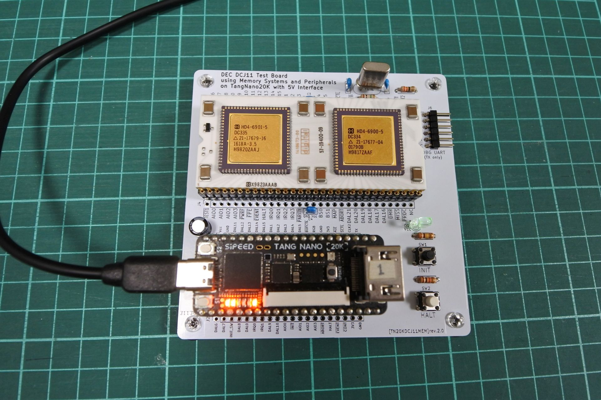

# TangNanoDCJ11MEM (unix for rev2 PCB)



- [unix-v1](../../applications/unix-v1/)，[unix-v6](../../applications/unix-v6/)で必要だったパターンカットとジャンパ線を反映させた基板rev2.0用のHDLコードです．
- FPGAのクロックをCPUからのCLK2に同期させることによってかなり安定して動くようになりました．
- unix v1, v6が起動します．(SDメモリはそれぞれ別に用意する必要があります．)
  - 使い方はrev1.1基板の[unix-v1](../unix-v1/)，[unix-v6](../unix-v6/)と同じです．
    - 173000g でv1用ブートローダ起動
    - 174000g でv6用ブートローダ起動．'@'でunixと入力する．
- rev1.1基板でも，CPUのCLK2を33Ω程度のダンピング抵抗をはさんでGPIO_RXに接続すればrev2.0用のHDLコードで動作します．
```
DCJ11               rev1.1基板
CLK2 ---33Ω抵抗--- GPIO_RX
```


## 更新履歴
- 2025/09/04: 20250904.pcbrev2
