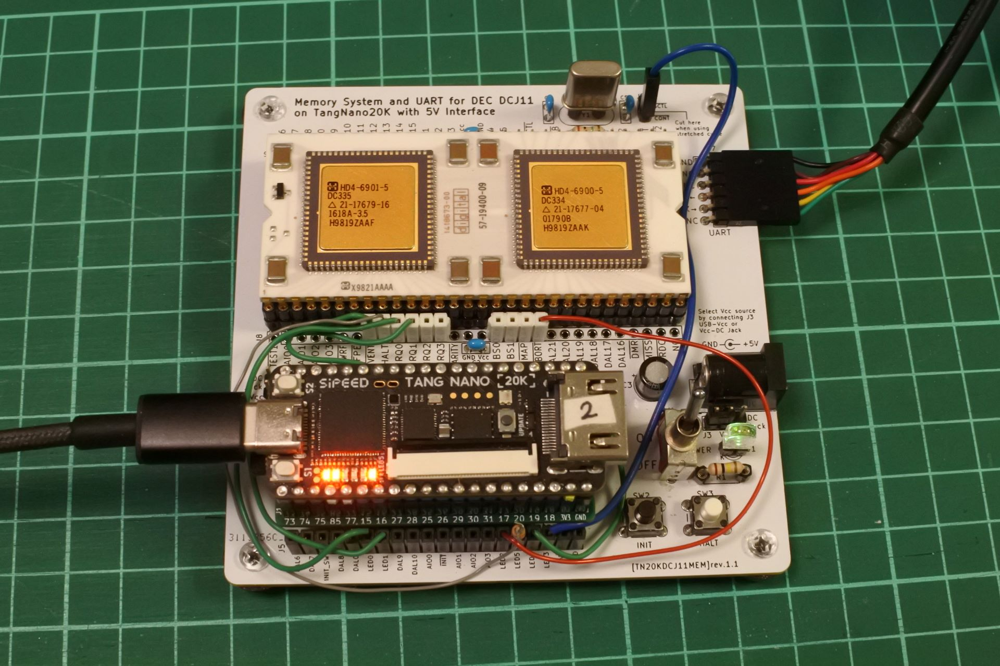
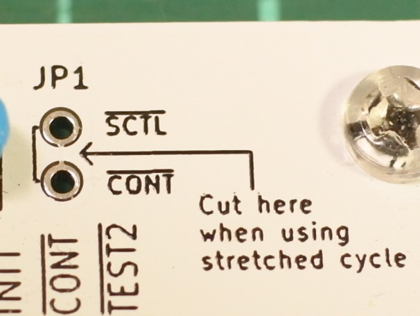
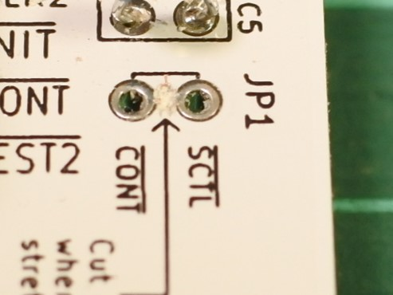

# TangNanoDCJ11MEM (unix-v1)


- TangNano20K上にPDP11用のメモリシステムや周辺装置を実装してUNIX first edition (UNIX V1)を動作させる試みです．
- まだかなり不安定で，ちょっと修正しただけで起動しなくなるのですが，とりあえず公開することにしました． ~~それなりに安定して動くようになりました．~~ やっぱりまだ不安定です．
- ~~DMAの制御が面倒だったので、時分割された擬似dual port RAMを作ってディスクからメモリへの読み書きをしています．~~
- ディスク読み書き時にstretched cycleでCPUを停止させることにしました．ピンが足りないので，DMR_n，MAP_nを使わずに，CONT_nだけで停止させてDMAしています．これによりだいぶ安定しました．JP1の切断と，LED3からCONT_nへのジャンパ接続が必要です．

## 最近の話題
### 2024/07/29 (0729.beta版公開)
  - UNIX V6に必要な機能を逐次追加していますが，修正のたびにV1の動作確認をするのが面倒なので別のバージョンとしてこちら [unix-v6](../unix-v6/) に置くことにしました．
  - メモリを30KWにしました．
  - ABORT_nをトライステートにしました．(UNIX V1では使用してないので気にしなくていいです．)

## TangNano20K上に実装したもの
- メインメモリ
  - 32K word (64k byte)．(000000〜167777の30KWがRAM，170000〜177777はROMとI/O)
- UART
  - USBとGPIOの2系統．通常はUSBがコンソールでGPIOはデバッグ情報を出力．
- ASR-33 (teletype)
  - UARTを使ったconsole機能(レジスタと割り込み)
- RF11(drum), RK11(disk)
  - ハードディスク装置をSDメモリでエミュレートします．
- KE11-A(Extended Arithmetic Element)
  - 外部演算装置です．UNIX V1では乗除算，シフト演算をCPUではなくこの装置で実行していることがあるので必須です．(diskのブロック計算で12で割る程度の計算をこれにやらせています．．．)
- KW11-L(Line time clock)
  - EVENT端子経由で60Hzの割り込みを発生させます．

## SDメモリによるディスク(RF，RK)のエミュレーションについて
 - SIMH用のimageファイルを継げたものを利用できます．(下記手順参照)
 - SDメモリはファイルシステム無しの生のままで使うのでddで読み書きします．
 - ブロックサイズ(BS)は512で，0〜1023ブロックがRF11，それ以降がRK11です．
 - SanDiskのsd(2GB)，KIOXIAのsdhc(32GB)，SAMSUNGのsdxc(64GB)での動作を確認しています．

## とりあえず動かすための手順
### JP1の切断
レジストの色によってはわかりにくいですが，基板右上にあるJP1の端子(SCTL_n と CONT_n)はパターンで接続されています．Stretched cycleを使用するため，これをカットします．(今となっては最初から切断してピンヘッダを立てるようにした方がスマートでしたが，当初はもしかしたら使うかも程度に思っていたので．)



### ジャンパ配線等
- ~~クロック用の水晶を4MHzにする~~ 0716.betaから18MHzでも動作するようになりました。ちなみに2MHzでも動いています．

- IRQ、EVENT、CONT_n用に下記ジャンパ配線をする。HALTはデバッグ用なので任意。HALTはスイッチと競合するので1kΩの抵抗を付けます。
```
DCJ11       TangNano5V
IRQ0    --- LED0  (ttyi, ttyo用)
IRQ1    --- LED1  (drum, disk用)
EVENT_n --- LED4  (clock用)
CONT_n  --- LED3  (stretched cycle用)

HALT    ---1kΩ抵抗--- LED5 (デバッグ用, 無くても可)

```
### SDメモリの準備
- [jserv/unix-v1](https://github.com/jserv/unix-v1) にあるsimh用のunix-v1環境一式をmakeし， images/rf0.dsk, images/rk0.dsk からsd用のイメージsd.dskを作り、sdメモリに書き込む。(書き込み先のsdメモリが/dev/sdb で正しいかちゃんと確認すること。間違えるとPCのディスクを破壊します。)
- 参考手順は下記の通り。
```
git clone https://github.com/jserv/unix-v1.git
cd unix-v1
make
dd if=images/rf0.dsk of=sd.dsk
dd if=images/rk0.dsk of=sd.dsk bs=512 seek=1024
sudo dd if=sd.dsk of=/dev/sdb
```

## コンソール出力やポートについて
- TangNanoのUSB UART
  - DCJ-11のコンソール入出力とFPGAへの書き込みに使用します．
  - windows環境でTangNanoをUSB接続し，TeraTermでコンソール表示しながらビットストリームを書く場合，Gowin ProgrammerでUSB Debugger Aのポートが複数出現するので，プルダウンメニューで適切なものを選ぶ必要があります．
- GPIO UART
  - `define USE_GPIOUART_DEBUG が有効 → デバッグ情報(下記参照)が出力されます．
  - `define USE_GPIOUART_DEBUG をコメントアウト → Tang NanoのUSB UARTと同じものが出力されます．(起動しなくなることがあります．)
  - 入力はUSBとandで継げているので，速度が同じ場合はGPIO入力もコンソール入力になります．
- USBのシリアルとGPIOのシリアルはTeratermでシリアルポートを適切に選択すれば同時に見れます．
- シリアルの設定は115200bps,8N1Nです．(UNIX V6だと7N1Nにしないと文字化けする現象あり．)(速度はtop.vで変更可ですが，起動しなくなることがあります．)

## boot loaderについて
- simh版のboot loaderは73700番地に配置されていましたが，そこはRAM領域だし，オリジナルの資料によると173700のROM領域にあったので173700に配置しました．
- Power up configuration では1000番地単位にしか飛べないので，173000番地にPS=340とjmp 173700を置いてあります．
- INIT時に読み込まれる Power up configuration をTang NanoのSW2で選択するようにしました．
  - SW2を押さずにINIT: console ODTが起動します．
  - SW2を押しながらINIT: 173000番地から起動します．
  - console ODTからブートするには 173000g と入力して下さい．
- ~~ROM領域は書き込み禁止にはしてないので，上書きされる可能性があります．その場合はconsole ODTでboot.txtの手順で書き込むか，TangNanoを再起動してメモリを初期化します．~~ ROM領域は書き込み不可にしました．

## デバッグ用の機能について
- デバッグ用の機能をいくつか実装しています．詳細はtop.vを見て下さい．
### disk accessログ
- top.vの `define USE_GPIOUART_DEBUG を有効にすると使えます．
- GPIOのUARTにディスクアクセスに関する情報を出力しています．
  - 100μ秒のカウンタ，ディスク関連レジスタ，最後に読んだ命令のアドレスなどを表示しています．
### ブレークポイント
- デバッグ用レジスタDBG_REG0〜2(177100, 177102, 177104番地)に書いたアドレスの命令をフェッチしたときにHALT信号を出力する機能です．トリガ条件は下記の2種類があります．
  - (address == DBG_REG0 )
  - (address == DBG_REG1 ) の後に(address == DBG_REG2 )
- ~~address == 01040 (panic:)でもHALTするようにしています．~~ 

### 命令ログ
  - 177000〜177056番地に，HALTする直前にフェッチしていた命令のアドレスを24個記録しています．原因不明のHALTが起きたときの解析用です．(プリフェッチしているので，実行ではなくフェッチです．時系列は177000→177056の順．バージョンによっては個数が違う場合あり．詳細はソース参照．)

## 既知のノウハウ
- single user modeの方が起動しやすいです。177570番地の値を73700にして起動するとsingle user modeになります。
- 過去に起動した環境で起動しなくなったようなときは、sdメモリのディスクイメージが破壊されている可能性があるので、sd.dskに書き直します。
- 起動しにくい状態になったときは，ビットストリームをロードした直後の方が起動しやすい気がします．
- HALT SWで止めてレジスタやメモリを見たあとに p でUNIXに戻れます．(console ODTの機能)
- 予期せぬHALTで停止したときは，命令ログ(177000〜177056番地)，R0〜R7，スタックポインタ(R6)周辺の±8ワードぐらいをダンプして観察するのが初手です．スタックポインタがずれてたり，値がおかしくて変な番地にリターンしてHALTすることが多いです．

## 既知の問題
- 20240719版以降でだいぶ安定しました．クロック18MHz(2MHzでもOK)，デバッグ出力あり(無しでもOK)で，cコンパイラがわりと安定して動作しています．
- ~~時間制約(sdcファイル)の記述がよくわからないので，sys_clk=27MHzだけしか記述していません．そのせいかタイミングのwarningが多数出ます．~~
- sys_clk=27MHzだけだと起動しなくなる現象が発生しやすいので，ALE_nとSCTL_nも4.5MHzで適当な位相で書いてあります．正しい書き方は不明です．
- GPIOのデバッグ情報出力の有無を変更するとUNIXが起動しなくなる場合があり，時間制約を適当に修正すると起動することがあります．
- 起動しなくなる現象はdisk完了のIRQが出ていないのが主な原因だったっぽいのでdisk_readyのロジックを修正して少しはマシになりましたが完治はしていません．雑な修正(dirty workaround)です．
- UNIX V6は起動しません．
- デバッグログのIRQ_ttyi, IRQ_ttyoの判定条件がvec_readではなくbus_readになっているので割り込み以外でベクタの番地を読んだときも表示されます(0727.beta)．次版で修正します．

## 過去の問題
- ~~login時に000056や00002でHALTすることがあります．どうやらスタックポインタが1ワードずれているのが原因のようで，現在調査中です．~~
- ~~login時にpasswdファイルが読めないというエラーが起きることがあります．~~
- ~~root dir (/) が読めない状態になることがあります．(その際，コマンドは'No command'になります．) 000051(/のinode番号)であるはずのrootdir(25246番地)が000041や000050に化けていることが原因ですが，化ける原因についてはまだわかっていません．~~
- ~~HALTでなく，idle状態で止まることもあります．diskやttyの終了割り込み関連な気がしますが調査中です．~~ たぶん割り込みが発生しないのでidleのwait命令で止まっている．
- ~~とにかく不安定です． 起動したりしなかったりします．よく落ちます．~~
- ~~リセット時間を250msから350msに変えただけで起動しなったりします。~~
- ~~UARTの速度を変えただけで起動しなかったりします．~~ 対処しました．
- ~~UARTが不安定で文字化けします．~~ 対処しました．
- ~~論理合成時に，logical loopがあるというwarningが大量に出ます．除算器の部分なのですが，特に問題は無いはずなので放置しています．~~ 非同期SR付きDFFが合成できないというのが原因のようだったので修正しました．
- ~~論理合成時に，タイミング関連で警告が大量に出ているのですが，対処方法調査中です．不安定なのはこのあたりが原因かもしれません．~~ 一応対処しました．
- ~~0710.alphaでRF,RKの制御を大幅に修正し，/usrディレクトリ(RK)でmkdirができるようになりましたが，あいかわらず不安定です．~~ 0712.alphaで解消
- ~~/usrディレクトリ(RK)でcpするとHALTすることがあります．~~ 0712.alphaで解消

- SCTL_n，ALE_nのエッジ検出の実装方法を変えると起動しなくなることがあります．たぶんこれも時間制約がらみな気がします．
- 20240719.beta版で，1040番地でHALTする部分をコメントアウトすると起動しなくなりました．時間制約を下記のように修正すると起動するようになりました．次回リリースで修正します．
```
create_clock -name sys_clk -period 37.037 -waveform {0 18.518} [get_ports {sys_clk}]
create_clock -name ALE_n -period 222.222 -waveform {0 100} [get_ports {ALE_n}]
create_clock -name SCTL_n -period 222.222 -waveform {33.33 166.666} [get_ports {SCTL_n}]
```
## 動画
- [UNIX V1 on DEC DCJ-11 with TangNano 20K (under development)](https://www.youtube.com/watch?v=DT7xJWeF46Y)

- [UNIX V1 on DEC DCJ-11 with TangNano 20K](https://www.youtube.com/watch?v=G9AFgAaTexo)

## 更新履歴
- 2024/06/28: テスト用バージョン(TangNanoDCJ11MEM_project.0628.alpha)暫定公開．GPIOのUARTにディスクアクセスの情報を出力します．
- 2024/07/04: テスト用バージョン(0704.alpha)upload．
- 2024/07/07: テスト用バージョン(0707.alpha)upload．
- 2024/07/09: テスト用バージョン(0709.alpha)upload．
- 2024/07/10: テスト用バージョン(0710.alpha)upload．RFとRKのコマンド受付を並列化しました．
- 2024/07/12: テスト用バージョン(0712.alpha)upload．命令ログ機能追加．diskログ機能用のフラグ(`define USE_GPIOUART_DEBUG)はコメントアウトしました．
- 2024/07/13: テスト用バージョン(0713.alpha)upload．IRQ関連を修正．命令ログ拡張．
- 2024/07/14: テスト用バージョン(0714.alpha)upload．デバッグ用レジスタのアドレス等を変更．
- 2024/07/16: テスト用バージョン(0716.beta)upload．stretched cycle導入．JP1の切断と，LED3からCONT_nへのジャンパ接続が必要です．GPIO uartのデバッグログ機能をoffにすると起動しなくなるので，ONにしています．
- 2024/07/19: テスト用バージョン(0719.beta)upload．これまでに比べるとだいぶ安定しました．高速18MHz/低速2MHz， デバッグログあり/無し，のいずれでもcコンパイラが動作しています．
- 2024/07/26: テスト用バージョン(0726.beta)upload．(いろいろ不備が見つかったのでキャンセルしました．)
- 2024/07/27: テスト用バージョン(0727.beta)upload．
  - disk_ready logicの安定化．
  - uart.vのTXにバッファを付けたので文字出力が高速になりました．低速動作も110bpsまで動作するように修正しましたが，TangNanoのUSBシリアルは最低1200bpsでした．
  - UNIX V6実験用の機能(ABORT_n, ROM領域, RKからのboot)を追加しました．
  - GPIOのシリアルはデバッグ情報出力をデフォルトにしました．オフにすると起動しなくなることがあります．
- 2024/07/28: oldフォルダが肥大化してきたので一部削除しました．
- 2024/07/28: テスト用バージョン(0728.beta)upload．160000番地readでbus errorにしました．(V6実験用)
- 2024/07/29: 0729.beta公開．unix-v1とunix-v6のフォルダを分離．
