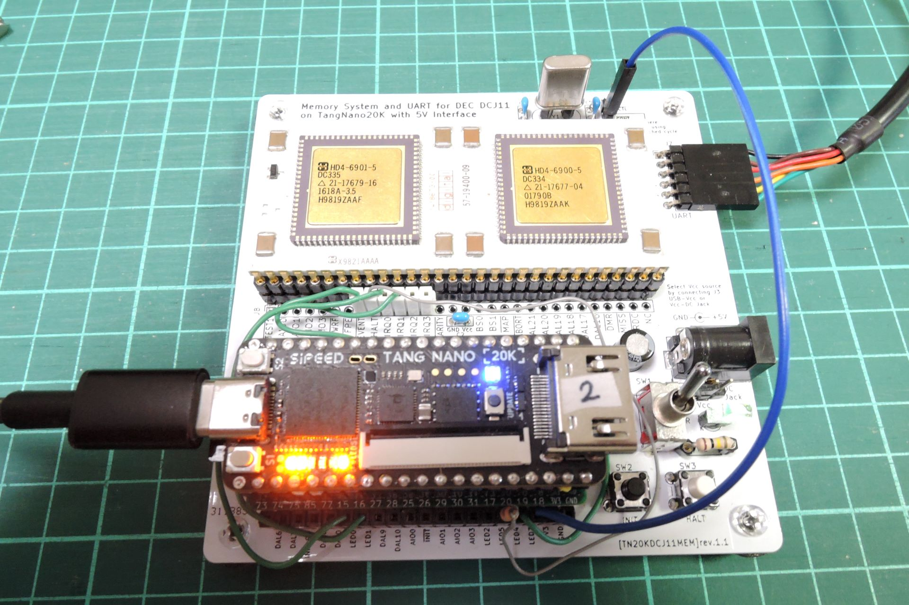

# TangNanoDCJ11MEM (unix-v1)


- SDメモリを使ったdiskエミュレータを作成し，UNIX V1を動かそうとしています．
- まだかなり不安定で，ちょっと修正しただけで起動しなくなるのですが，とりあえず公開することにしました．
- ~~DMAの制御が面倒だったので、時分割された擬似dual port RAMを作ってディスクからメモリへの読み書きをしています．~~
- ディスク読み書き時にstretch cycleでCPUを停止させることにしました．ピンが足りないので，DMR_n，MAP_nを使わずに，CONT_nだけで停止させてDMAしています．これによりだいぶ安定しました．JP1の切断と，LED3からCONT_nへのジャンパ接続が必要です．

## RF11(drum), RK11(disk)エミュレータ [sdhd.v](TangNanoDCJ11MEM_project/src/sdhd.v)
- SDメモリはファイルシステム無しの生のままで使うのでddで読み書きします．
- ブロックサイズ(BS)は512で，0〜1023ブロックがRF11，それ以降がRK11です．

## とりあえず動かすための手順
### JP1の切断
レジストの色によってはわかりにくいですが，基板右上にあるJP1の端子(SCTL_n と CONT_n)はパターンで接続されています．Stretched cycleを使用するため，これをカットします．(今となっては最初から切断してピンヘッダを立てるようにした方がスマートでしたが，当初はもしかしたら使うかも程度に思っていたので．)


### ジャンパ配線等
- ~~クロック用の水晶を4MHzにする~~ 0716.betaから18MHzでも動作するようになりました。

- IRQ、EVENT、CONT_n用に下記ジャンパ配線をする。HALTはデバッグ用なので任意。HALTはスイッチと競合するので1kΩの抵抗を付けます。(20240712版以前はIRQ1とIRQ2を使用していましたが，IRQ0とIRQ1が正しいです．)
```
DCJ11       TangNano5V
IRQ0    --- LED0  (ttyi, ttyo用)
IRQ1    --- LED1  (drum, disk用)
EVENT_n --- LED4  (clock用)
HALT    ---1kΩ抵抗--- LED5 (デバッグ用, 無くても可)

CONT_n  --- LED3 (stretched cycle用)
```
### SDメモリの準備
- [jserv/unix-v1](https://github.com/jserv/unix-v1) にあるsimh用のunix-v1環境一式をmakeし， images/rf0.dsk, images/rk0.dsk からsd用のイメージsd.dskを作り、sdメモリに書き込む。(書き込み先のsdメモリが/dev/sdb で正しいかちゃんと確認すること。間違えるとPCのディスクを破壊します。)
- 参考手順は下記の通り。
```
git clone https://github.com/jserv/unix-v1.git
cd unix-v1
make
dd if=/dev/zero of=sd.dsk bs=512 count=8192
dd if=images/rf0.dsk of=sd.dsk
dd if=images/rk0.dsk of=sd.dsk bs=512 seek=1024
sudo dd if=sd.dsk of=/dev/sdb
```

## コンソール出力やポートについて
- コンソール出力はTang NanoのUSB UARTとGPIO UARTの両方に同じものが出力されます．ただし，デバック用出力機能 `define USE_GPIOUART_DEBUG が有効になっている場合は，GPIOにはデバッグ情報だけが出力されます．
- USBのシリアルとGPIOのシリアルはTeratermでシリアルポートを適切に選択すれば同時に見れます．
- windows環境でTeraTermでコンソール表示しながらTangNanoのUSBでビットストリームを書く場合，Gowin ProgrammerでUSB Debugger Aのポートが複数出現するので，プルダウンメニューで適切なものを選ぶ必要があります．

## boot loaderについて
- simh版のboot loaderは73700番地に配置されていましたが，そこはRAM領域だし，オリジナルの資料によると173700のROM領域にあったので173700に配置しました．
- ~~Power up configurationにより，INITでboot loaderにジャンプするようにしています．ただし1000番地単位にしか飛べないので，173000番地にPS=340とjmp 173700を置きました．~~ 
- ~~電源ONや，FPGAへの書き込み直後はSDの読み込みに失敗するせいか，54000あたりでHALTします．もう一度INITボタンを押すと起動します．~~
- INIT時に読み込まれる Power up configuration をTang NanoのSW2で選択するようにしました．
  - SW2を押さずにINIT: console ODTが起動します．
  - SW2を押しながらINIT: 173000番地から起動します．
  - console ODTからブートするには 173000g と入力して下さい．
- ~~電源ONや，FPGAへの書き込み直後はSDの読み込みに失敗するせいか，54000あたりでHALTします．もう一度INITボタンを押すと起動します．~~
- ROM領域は書き込み禁止にはしてないので，上書きされる可能性があり，その場合はconsole ODTでboot.txtの手順で書き込みます．

## デバッグ用の機能について
- デバッグ用の機能をいくつか実装しています．詳細はtop.vを見て下さい．
### disk accessログ
- top.vの `define USE_GPIOUART_DEBUG を有効にすると使えます．
- GPIOのUARTにディスクアクセスに関する情報を出力しています．
  - 100μ秒のカウンタ，ディスク関連レジスタ，最後に読んだ命令のアドレスなどを表示しています．
### ブレークポイント
- デバッグ用レジスタDBG_REG0〜2(177100, 177102, 177104番地)に書いたアドレスの命令をフェッチしたときにHALT信号を出力する機能です．トリガ条件は下記の2種類があります．
  - (address == DBG_REG0 )
  - (address == DBG_REG1 ) の後に(address == DBG_REG2 )
### 命令ログ
  - 177000〜177036番地に，HALTする直前にフェッチしていた命令のアドレスを16個記録しています．原因不明のHALTが起きたときの解析用です．(プリフェッチしているので，実行ではなくフェッチです．時系列は177000→177036の順．バージョンによっては個数が違う場合あり．詳細はソース参照．)

## 既知のノウハウ
- single user modeの方が起動しやすいです。177570番地の値を73700にして起動するとsingle user modeになります。
- 過去に起動した環境で起動しなくなったようなときは、sdメモリのディスクイメージが破壊されている可能性があるので、sd.dskに書き直します。
- 起動しにくい状態になったときは，ビットストリームをロードした直後の方が起動しやすい気がします．
- HALT SWで止めてレジスタやメモリを見たあとに p でUNIXに戻れます．(console ODTの機能)
- 予期せぬHALTで停止したときは，命令ログ(177000〜177036番地)，R0〜R7，スタックポインタ(R6)周辺の±8ワードぐらいをダンプして観察するのが初手です．スタックポインタがずれてたり，値がおかしくて変な番地にリターンしてHALTすることが多いです．

## 既知の問題
disk読み書きを時にstretch cycleにしてCPUを停止させたら下記の問題の多くが解消されましたがまだ様子を見ているところです。
- login時に000056や00002でHALTすることがあります．どうやらスタックポインタが1ワードずれているのが原因のようで，現在調査中です．
- login時にpasswdファイルが読めないというエラーが起きることがあります．
- root dir (/) が読めない状態になることがあります．(その際，コマンドは'No command'になります．) 000051(/のinode番号)であるはずのrootdir(25246番地)が000041や000050に化けていることが原因ですが，化ける原因についてはまだわかっていません．
- HALTでなく，idle状態で止まることもあります．diskやttyの終了割り込み関連な気がしますが調査中です．
- ~~とにかく不安定です．~~ 起動したりしなかったりします．よく落ちます．
- ~~リセット時間を250msから350msに変えただけで起動しなったりします。~~
- ~~UARTの速度を変えただけで起動しなかったりします．~~ 対処しました．
- ~~UARTが不安定で文字化けします．~~ 対処しました．
- ~~論理合成時に，logical loopがあるというwarningが大量に出ます．除算器の部分なのですが，特に問題は無いはずなので放置しています．~~ 非同期SR付きDFFが合成できないというのが原因のようだったので修正しました．
- ~~論理合成時に，タイミング関連で警告が大量に出ているのですが，対処方法調査中です．不安定なのはこのあたりが原因かもしれません．~~ 一応対処しました．
- ~~0710.alphaでRF,RKの制御を大幅に修正し，/usrディレクトリ(RK)でmkdirができるようになりましたが，あいかわらず不安定です．~~ 0712.alphaで解消
- ~~/usrディレクトリ(RK)でcpするとHALTすることがあります．~~ 0712.alphaで解消

## 動画
- [UNIX V1 on DEC DCJ-11 with TangNano 20K (under development)](https://www.youtube.com/watch?v=DT7xJWeF46Y)

## 更新履歴
- 2024/06/28: テスト用バージョン(TangNanoDCJ11MEM_project.0628.alpha)暫定公開．GPIOのUARTにディスクアクセスの情報を出力します．
- 2024/07/04: テスト用バージョン(0704.alpha)upload．
- 2024/07/07: テスト用バージョン(0707.alpha)upload．
- 2024/07/09: テスト用バージョン(0709.alpha)upload．
- 2024/07/10: テスト用バージョン(0710.alpha)upload．RFとRKのコマンド受付を並列化しました．
- 2024/07/12: テスト用バージョン(0712.alpha)upload．命令ログ機能追加．diskログ機能用のフラグ(`define USE_GPIOUART_DEBUG)はコメントアウトしました．
- 2024/07/13: テスト用バージョン(0713.alpha)upload．IRQ関連を修正．命令ログ拡張．
- 2024/07/14: テスト用バージョン(0714.alpha)upload．デバッグ用レジスタのアドレス等を変更．
- 2024/07/16: テスト用バージョン(0716.beta)upload．stretched cycle導入．JP1の切断と，LED3からCONT_nへのジャンパ接続が必要です．GPIO uartのデバッグログ機能をoffにすると起動しなくなるので，ONにしています．
