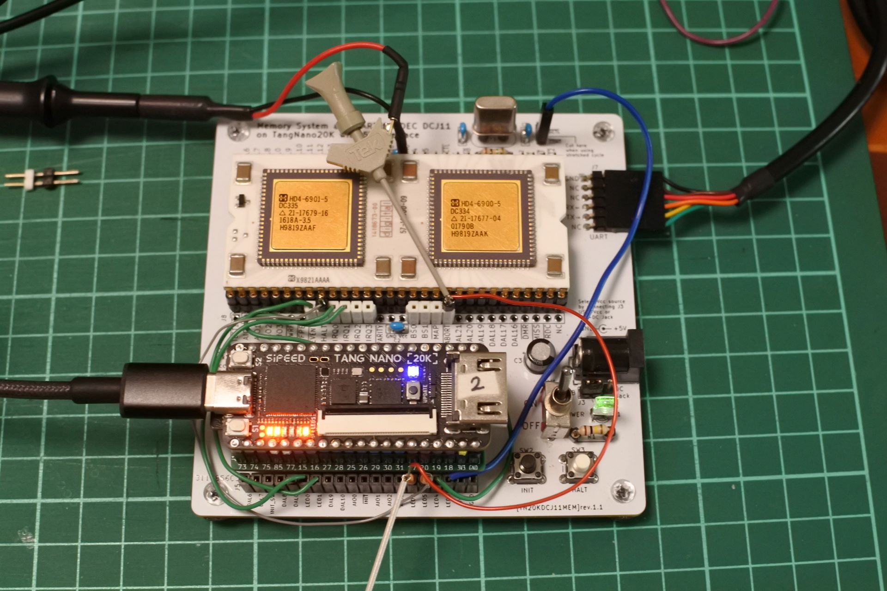

# TangNanoDCJ11MEM (unix-v6)


[unix-v1](../unix-v1/)をベースにしてUNIX V6に必要な機能を逐次追加していく試みです．

## 最近の話題
- 2024/07/29の更新内容
  - unix-v1用とunix-v6用を別プロジェクトにしました．
  - 160000台を全部つぶすのはもったいないのでRAM30KWにしました．
  - ABORT_nをトライステートにして，非アサート時は'Z'にしました．
- **ABORT_nとLED2は直接ジャンパせずに抵抗を入れて下さい．**
- ABORT_nは双方向で，INIT時にDCJ11がアサートしているため直結だと数十mAの電流が流れてしまうことがわかりました．1KだとLレベルまで下がらず，本当は470Ωぐらいにしたいのですが，立ち下がりが間に合わないようなので100Ωで対処しています．アサート時以外はZにしたのでINIT時の競合は回避できています．

- 20240728.beta版以降でUNIX V6実験用の機能を追加しています．(とりあえず作ってみた程度のものです．)
- rkunixが ~~文字化けしながら~~ マルチユーザーで起動しました．
- 下記の場合にLED2にABORT_n(bus error)を(意図的に)出力します．
  - 177700へのread (power-up sequenceのMicrodiagnostic test 2 用)
  - ~~160000〜167777へのwrite~~
  - ~~160000〜160077~~ 170000〜170077へのread．(mainの最初のcoremap初期化ループのfuibyteをエラーにしてメモリサイズを特定するのに必要．)
- ~~160000~~ 170000〜177777までは書き込みできないROMエリアにしました．(I/Oは除く)
- RK0用ブートストラップローダー
  - RK0のblock 0 (SDメモリのblock 1024)のブートストラッププログラムを0〜776番地(256word(=512byte))にロードして0番地にジャンプします．
  - 174000〜のROMに配置したので，174000g で起動します．(詳細はrom.v参照)
- UNIX V6起動実験について
  - かんぱぱさんの [unix v6の起動にチャレンジ](https://lateral-apartment-215.notion.site/unix-v6-67b9abee6b784c4795d5094cf69c4f96) が大変参考になりました．
  - アドレス空間が18bit必要だと思っていたのですが，28KWのPDP11で動いていたとのことなので試してみることにしました．
  - メモリ容量の判定にbus errorを使っているみたいだったのでABORT_nを実装しました．
  -  DC11は実装していないので，とりあえず最小限の構成のrkunixで試してみたところ， ~~文字化けしながら~~ 起動しました． (PDP11GUI，TeraTermでデータを7bitだと文字化けしなくなりました．)
  - single userはsr(177570)=173030 ですが，マルチユーザーで起動しました．
  - イメージの作成は[Installing_UNIX_v6_(PDP-11)_on_SIMH](https://gunkies.org/wiki/Installing_UNIX_v6_(PDP-11)_on_SIMH)を参考にしています．
  - GPIO UARTの使い方を変更すると起動しなくなることがあります．デバッグ情報出力ありだけで動作確認しています．


### ジャンパ配線等
- IRQ、EVENT、CONT_n、ABORT_n用に下記ジャンパ配線をする。HALTはデバッグ用なので任意。HALTはスイッチと競合するので1kΩの抵抗を付けます。
- ABORT_nは双方向で，INIT時にDCJ11がアサートしているため直結だと数十mAの電流が流れてしまうことがわかりました．1KだとLレベルまで下がらず，本当は470Ωぐらいにしたいのですが，立ち下がりが間に合わないようなので100Ωで対処しています．アサート時以外はZにしたのでINIT時の競合は回避できています．
```
DCJ11       TangNano5V
IRQ0    --- LED0  (ttyi, ttyo用)
IRQ1    --- LED1  (drum, disk用)
EVENT_n --- LED4  (clock用)
CONT_n  --- LED3  (stretched cycle用)
ABORT_n ---100Ω抵抗--- LED2  (V6実験用)

HALT    ---1kΩ抵抗--- LED5 (デバッグ用, 無くても可)

```

## 更新履歴
- 2024/07/28: テスト用バージョン(0728.beta)upload．160000番地readでbus errorにしました．(V6実験用)
- 2024/07/29:
  - unix-v1とunix-v6のフォルダを分離．
  - 0729.v6.beta upload．ABORT_nをトライステート化．RAM 30MW化．bus errorの条件変更．
  