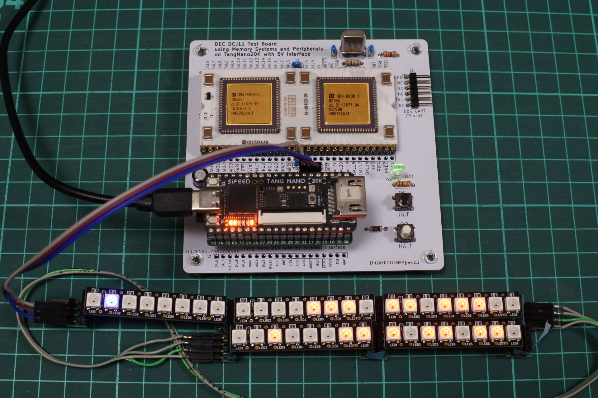
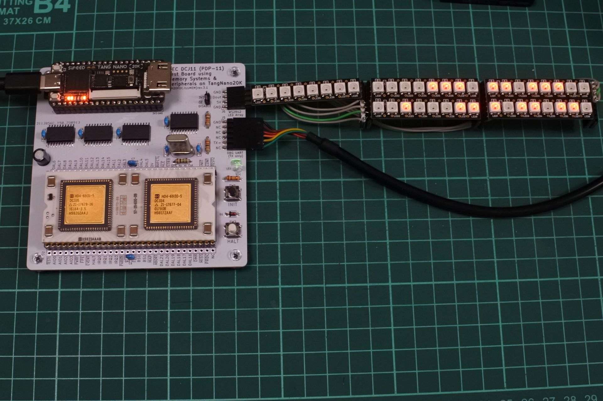
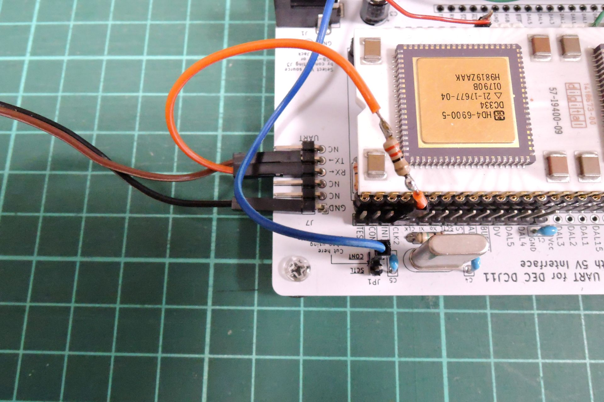

# TangNanoDCJ11MEM (unix for rev2.2 and rev3.1 PCB)




- [unix-v1](../../hdl.old/unix-v1/)，[unix-v6](../../hdl.old/unix-v6/)で必要だったパターンカットとジャンパ線を反映させたrev2.2基板，およびそれにレベル変換ICを追加したrev3.1基板用のHDLコードです．

- FPGAのクロックをCPUからのCLK2に同期させることによってかなり安定して動くようになりました．
- unix v1, v6が起動します．(SDメモリはそれぞれ別に用意する必要があります．)
  - 使い方はrev1.1基板の[unix-v1](../../hdl.old/unix-v1/)，[unix-v6](../../hdl.old/unix-v6/)と同じです．
    - 173000g でv1用ブートローダ起動
    - 174000g でv6用ブートローダ起動．'@'でunixと入力する．
- rev1.1基板でも，CPUのCLK2を33Ω程度のダンピング抵抗をはさんでGPIO_RXに接続すればrev2.2用のHDLコードで動作します．
```
DCJ11               rev1.1基板
CLK2 ---33Ω抵抗--- GPIO_RX
```


- RGB, GND, 3V3をWS2812に接続するとアドレスやデータを表示します．Aliで売られている安いLEDテープでも動作しました．

## 更新履歴
- 2025/09/04: 20250904.pcbrev2
- 2025/09/15: 20250915.pcbrev2 (ws2812モジュール修正)
- 2025/09/17: 20250917.pcbrev2 (SDメモリ無しで起動するとスタックしてリセットも効かなくなる問題を修正)
- 2025/09/22: 20250922 デバッグ用LED表示をsw2で切り変える機能を追加